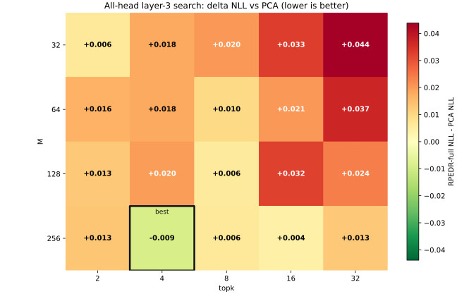
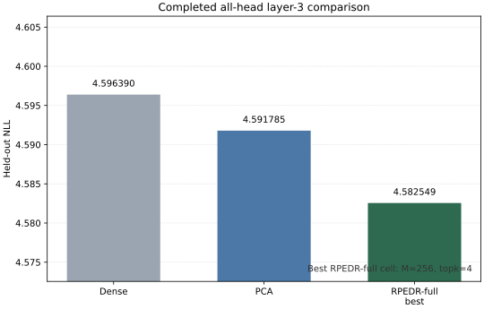
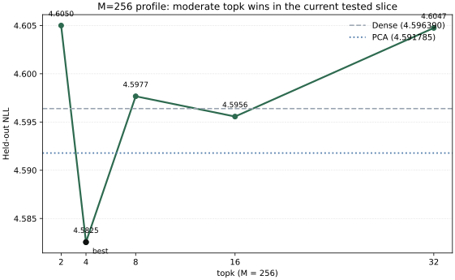

# RPE-Act-Comp

Early but credible research prototype for **RPEDR-style post-training Transformer V/O compression**; in the completed all-head `distilgpt2` layer-3 search, the best tested RPEDR-full setting beats head-wise PCA on held-out NLL/PPL **in the current tested slice**.

## Why This Project Matters

Most practical post-training subspace compression baselines for Transformer heads start from PCA. This project asks a sharper question: can a **supervised ensemble random subspace search** recover a better low-rank basis than head-wise PCA under the same rank budget, while keeping the workflow calibration-based and training-free?

The repo is aimed at fast, credible research prototyping rather than paper-ready claims. The current evidence is intentionally narrow: one model family, one layer, one compression locus, and one completed all-head search grid.

## Current Headline Result

**Completed all-head layer-3 search on `distilgpt2`**

- target: all 12 heads in layer `3`
- fixed budget: `rank_ratio=0.5`, `rank=32`, `L=256`
- search grid: `M in {32,64,128,256}`, `topk in {2,4,8,16,32}`
- best completed cell: **RPEDR-full, `M=256`, `topk=4`**
- held-out metrics: **NLL `4.582549`**, **PPL `97.763254`**, teacher-KL `0.051776`
- delta vs dense: `dNLL = -0.013842`, `dPPL = -1.362596`
- delta vs PCA: `dNLL = -0.009236`, `dPPL = -0.907142`

Interpretation: in the current tested slice, the promising region is **large `M` + moderate `topk`**. Increasing `topk` further at `M=256` does **not** improve over `topk=4`.

## Main Visuals

### Search Heatmap



### Baseline Snapshot



### `M=256` Top-k Profile



## Compact Leaderboard

| Method | Setting | NLL ↓ | PPL ↓ | Teacher-KL ↓ | Note |
|---|---|---:|---:|---:|---|
| Dense | no compression | 4.596390 | 99.125849 | — | reference |
| PCA | head-wise basis | 4.591785 | 98.670395 | 0.034198 | direct primary baseline |
| RPEDR-full (default) | `M=32`, `topk=2`, `L=256` | 4.597936 | 99.280442 | 0.054603 | single-head-derived default |
| RPEDR-full (best tested) | `M=256`, `topk=4`, `L=256` | **4.582549** | **97.763254** | 0.051776 | beats PCA on held-out NLL/PPL in the current tested slice; PCA still wins on teacher-KL |

## Method Overview


At a high level, the repo adapts the RPEDR selection-plus-ensemble idea to Transformer value/output compression:

1. collect per-head activation statistics on calibration splits
2. generate many random low-rank projector candidates
3. keep only the stronger candidates after cheap local screening
4. select group winners using the more expensive held-out scorer
5. recover a stable basis from the ensemble spectrum of winners
6. fold that basis into the value/output weights and evaluate on held-out LM metrics

## Experimental Protocol / Fairness

- compression locus: Transformer value/output (`V/O`) head subspace
- direct primary baseline: **head-wise PCA** under the same rank budget
- same fixed rank budget across compared methods in the showcased slice
- stochastic methods use seeds `0,1,2`
- held-out reporting uses the repo's split-aware protocol (`S0/S1/S2/S3`)
- current README figures are derived from the unified master table:
  - [`results/all_head_layer3_master_table/all_head_layer3_master_results.csv`](results/all_head_layer3_master_table/all_head_layer3_master_results.csv)
  - [`results/all_head_layer3_master_table/all_head_layer3_master_results.json`](results/all_head_layer3_master_table/all_head_layer3_master_results.json)

## Current Limitations / Claim Boundary

- this is **not** a claim that RPEDR generally beats PCA
- current evidence is limited to `distilgpt2`, layer `3`, all-head V/O compression, and the tested `M/topk` grid above
- the current best cell beats PCA on held-out NLL/PPL **in this tested setting**, but PCA remains stronger on teacher-KL
- there is no cross-model, cross-layer, or broad SOTA claim here
- the repo should be read as an early-stage but reproducible research prototype with a promising slice-specific signal

## Key Artifacts

- unified all-head master table:
  - [`results/all_head_layer3_master_table`](results/all_head_layer3_master_table)
- first all-head layer result:
  - [`results/multi_head_replication_distilgpt2_layer3_all_heads_round1`](results/multi_head_replication_distilgpt2_layer3_all_heads_round1)
- staged all-head `M/topk` diagnosis:
  - [`results/all_head_m_topk_diagnosis_layer3`](results/all_head_m_topk_diagnosis_layer3)
  - [`results/all_head_m_topk_diagnosis_layer3_stage2`](results/all_head_m_topk_diagnosis_layer3_stage2)
- current phase handoff:
  - [`notes/all_head_phase_handoff.md`](notes/all_head_phase_handoff.md)

## Reproducing The README Figures

```powershell
conda activate rpe-act-comp
python -c "import sys; print(sys.executable)"
python -V
pip -V
python scripts/13_generate_readme_figures.py
```

This regenerates the static SVGs under [`assets/readme`](assets/readme).

<details>
<summary><strong>Environment setup</strong></summary>

This repo uses the dedicated Conda environment `rpe-act-comp`.

```powershell
conda env create -f environment.yml
conda activate rpe-act-comp
python -m pip install -r requirements.txt
```

Verify the active interpreter:

```powershell
conda activate rpe-act-comp
python -c "import sys; print(sys.executable)"
python -V
pip -V
```
</details>

<details>
<summary><strong>Repository scope</strong></summary>

Current v1 scope:

- per-head and all-head Transformer V/O compression
- random vs PCA vs RPEDR-style basis search
- folded low-rank V/O weights
- held-out LM evaluation with split-aware reporting

This repo does **not** currently claim broad generalization across models or layers.
</details>

<details>
<summary><strong>Running experiments from the repo root</strong></summary>

After activating `rpe-act-comp`, run commands from the repository root.

Example all-head runner path:

```powershell
conda activate rpe-act-comp
python -c "import sys; print(sys.executable)"
python -V
pip -V
python scripts/09_run_multi_head_replication.py --data-config configs/data/wikitext2_single_head_cached.yaml --exp-config configs/exp/all_head_m_topk_diagnosis_layer3_stage2.yaml
```

Figure regeneration:

```powershell
conda activate rpe-act-comp
python -c "import sys; print(sys.executable)"
python -V
pip -V
python scripts/13_generate_readme_figures.py
```
</details>

<details>
<summary><strong>Project context</strong></summary>

Useful starting points:

- [`project_brief.md`](project_brief.md)
- [`docs/RPEDR_ICLR_CR.pdf`](docs/RPEDR_ICLR_CR.pdf)
- [`notes/index.md`](notes/index.md)

Status: early-stage research prototype with completed slice-specific all-head evidence.
</details>
